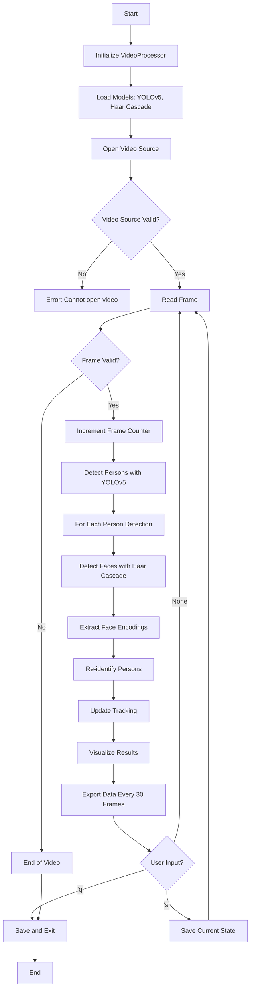
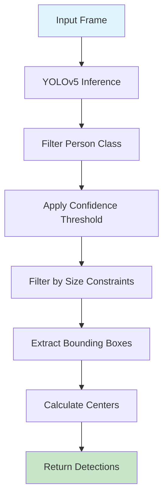
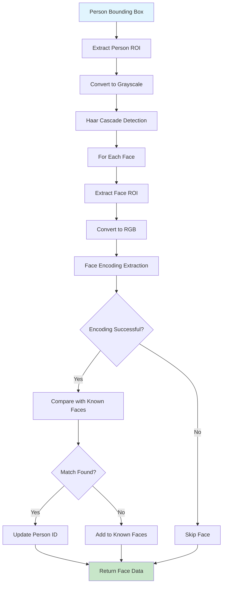
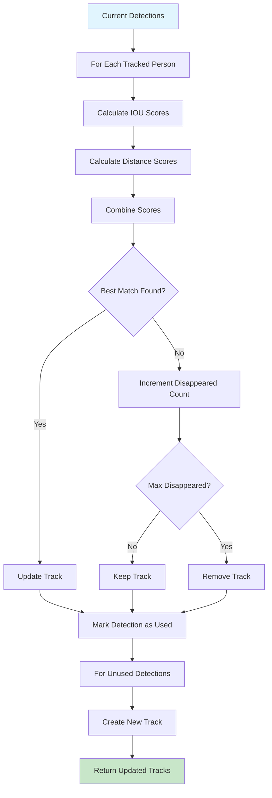
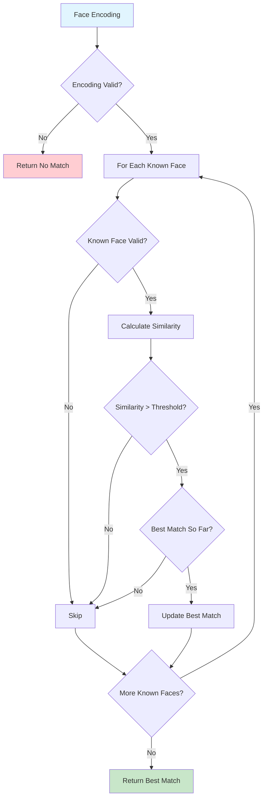
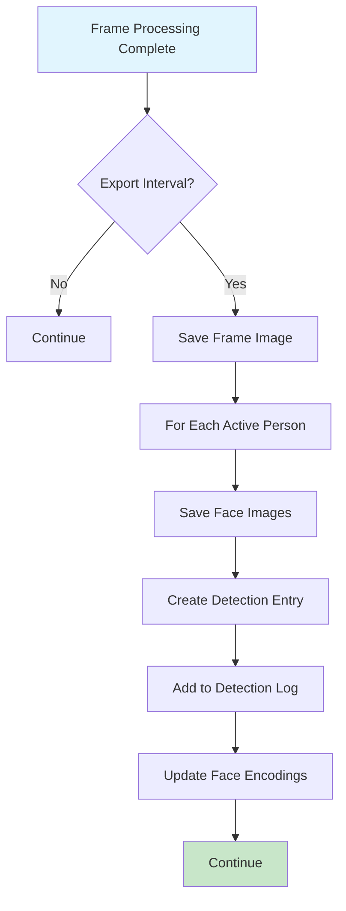
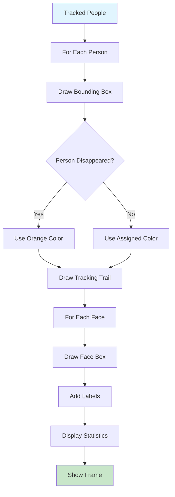
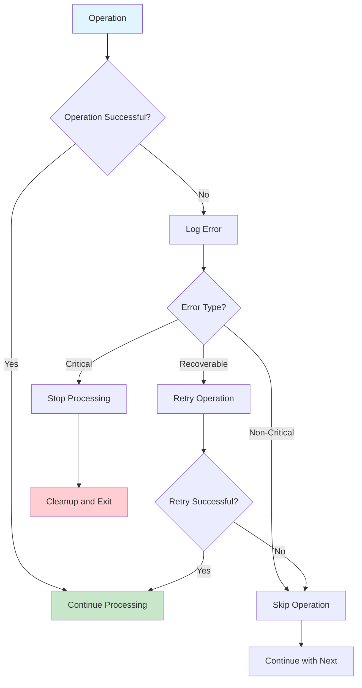
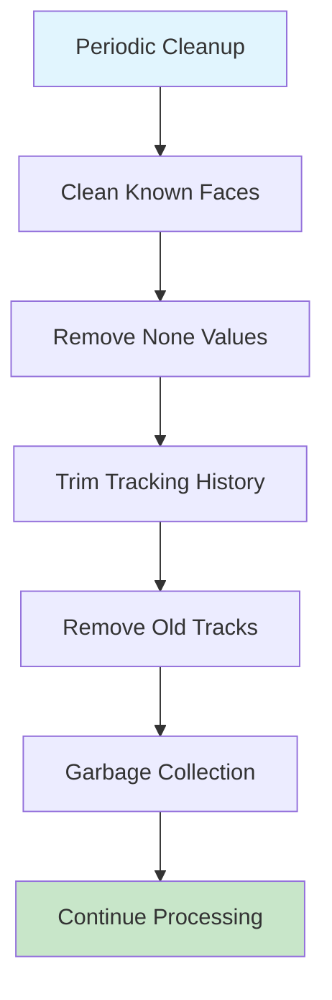
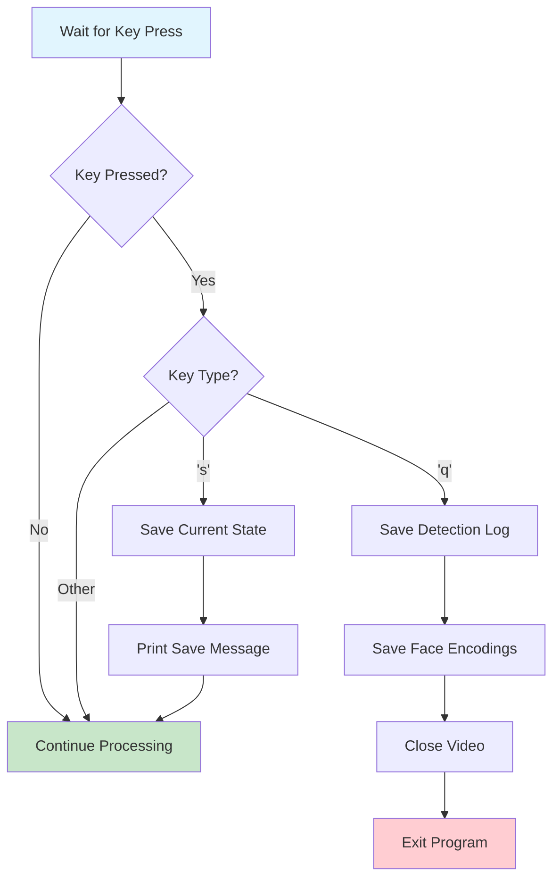

# RAP System Flow Diagrams

## 1. Main Processing Flow

## 2. Person Detection Flow

## 3. Face Detection and Recognition Flow

## 4. Multi-Object Tracking Flow

## 5. Face Re-identification Flow

## 6. Data Export Flow

## 7. Visualization Flow

## 8. Error Handling Flow

## 9. Memory Management Flow

## 10. User Interaction Flow

## Key Decision Points

### 1. Detection Thresholds
- **Person Detection**: Confidence > 0.5
- **Face Recognition**: Similarity > 0.6
- **Tracking**: IOU > 0.3

### 2. Timing Intervals
- **Export**: Every 30 frames
- **Cleanup**: Every 100 frames
- **Display**: Every frame

### 3. Memory Limits
- **Tracking History**: 30 frames per person
- **Disappeared Count**: 30 frames maximum
- **Color Palette**: 100 unique colors

### 4. Performance Optimizations
- **Batch Processing**: Face encodings
- **Early Termination**: Invalid detections
- **Memory Pooling**: Reusable objects
- **GPU Acceleration**: YOLOv5 inference 